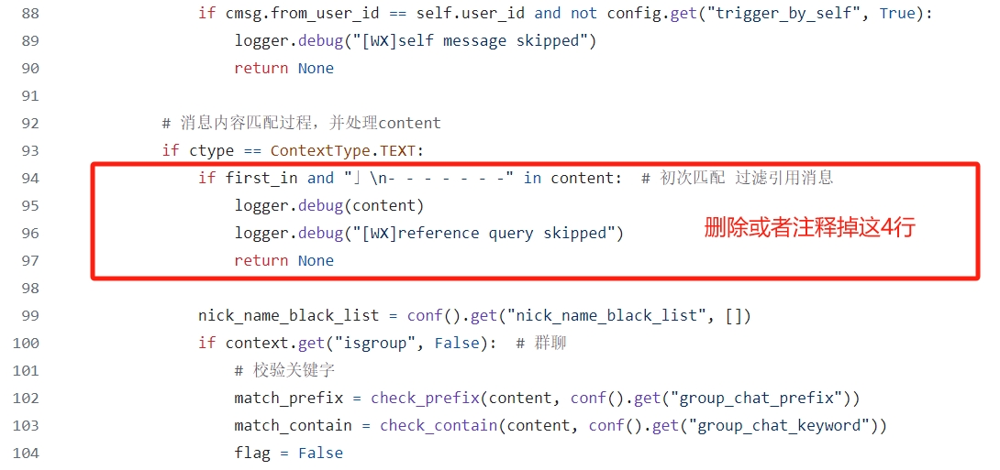

## 插件描述

爱情公寓剧本专享chatgpt-on-wechat插件，用于设置群聊中回复消息时@对方的概率、识别对方的身份以及优化引用消息。

## 安装方法

```sh
#installp https://github.com/wangxyd/ipartment.git
#scanp
```

## 配置步骤

配置文件为`config.json`，可以自行修改，示例如下：

```json
{
  "group_at_probability": 0,
  "add_quoter_nickname": true,
  "reply_reference_query": true
}
```

在以上配置项中：

- `group_at_probability`: 设置群聊中机器人回复消息时@对方的概率。取值范围0~1，0每次都不@对方，1每次都@对方；
- `add_quoter_nickname`: 是否开启识别对方身份的功能。值为`true`时会将对方的微信昵称添加到对话内容中，以便机器人识别对方的身份并做出有针对性的回答；
- `reply_reference_query`: 是否开启优化引用消息的功能。值为`true`时会告诉机器人，对话内容中哪部分是引用的消息，哪部分是新的问题。

## 备注

chatgpt-on-wechat默认忽略引用的消息，需要修改源代码才会响应引用的消息，然后才可以开启优化引用消息的功能。

需要修改的源代码文件为`channel/chat_channel.py`，注释掉或者直接删除下图中红色方框中的4行代码，然后重启chatgpt-on-wechat即可：



如果您有任何更好的想法或建议，都非常欢迎您积极提出哦~~~